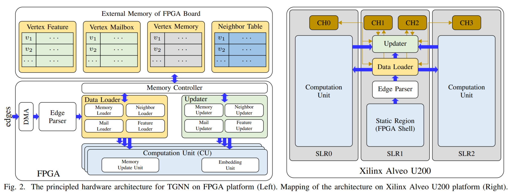

# TGNN-FPGA-IPDPS2022

[Hongkuan Zhou](https://tedzhouhk.github.io/about/), [Bingyi Zhang](https://sites.google.com/usc.edu/bingyi/home),  Rajgopal Kannan, Viktor Prasanna,  Carl Busart, A Model-Architecture Co-Design for High Performance Temporal GNN Inference on FPGA.  36th IEEE International parallel and distributed processing symposium, IPDPS 2022.

# TGNN-FPGA-IPDPS2022
Temporal Graph Neural Networks (TGNNs) are powerful models to capture temporal, structural, and contextual information on temporal graphs. The generated temporal node embeddings outperform other methods in many downstream tasks. Real-world applications require high performance inference on real-time streaming dynamic graphs. However, these models usually rely on complex attention mechanisms to capture relationships between temporal neighbors.
In addition, maintaining vertex memory suffers from intrinsic temporal data dependency that hinders task-level parallelism, making it inefficient on general-purpose processors. 
In this work, we present a novel model-architecture co-design for inference in memory-based TGNNs on FPGAs.
The key modeling optimizations we propose include a light-weight method to compute attention scores and a related temporal neighbor pruning strategy to further reduce computation and memory accesses. These are holistically coupled with key hardware optimizations that leverage FPGA hardware. We replace the temporal sampler with an on-chip FIFO based hardware sampler and the time encoder with a look-up-table.
We train our simplified models using knowledge distillation to ensure similar accuracy vis-\'a-vis the original model. Taking advantage of the model optimizations, we propose a principled hardware architecture using batching, pipelining, and prefetching techniques to further improve the performance. We also propose a hardware mechanism to ensure the chronological vertex updating without sacrificing the computation parallelism.
We evaluate the performance of the proposed hardware accelerator on three real-world datasets. 
The proposed model reduces the computation complexity by 84% and memory accesses by $67\%$ with less than 0.33% accuracy loss. 
Compared with CPU/GPU, our FPGA accelerator achieves 16.4/2.3x speedup in latency and $0.27\%$ improvement in accuracy compared with the state-of-the-art inference algorithm. 
To the best of our knowledge, this is the first work that performs model-architecture co-design on memory-based Temporal Graph Neural Networks.

# Platform
- Xilinx Alveo U200
- Xilinx ZCU104 

# Hardware architecture

  

